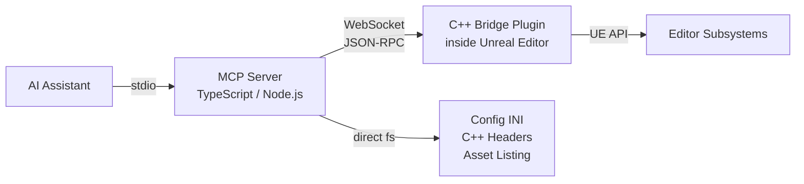

# UE-MCP
[](https://www.npmjs.com/package/ue-mcp)
[](https://www.npmjs.com/package/ue-mcp)
[](https://github.com/db-lyon/ue-mcp/actions/workflows/ci.yml)
[](https://github.com/db-lyon/ue-mcp/stargazers)
[](LICENSE)

**Unreal Engine Model Context Protocol Server** - gives AI assistants deep read/write access to the Unreal Editor through <!-- count:tools -->24<!-- /count --> category tools covering <!-- count:actions -->783+<!-- /count --> actions, plus a YAML flow engine for multi-step workflows and an npm plugin system for extending the surface.

On UE 5.8+ it also wraps Epic's entire native AI Toolset Registry - 830 official Unreal tools, called in-process and surfaced as `epic_*` actions in the matching category: Sequencer in `animation`, PCG in `pcg`, static meshes in `asset`.



Blueprints, materials, levels, actors, animation, VFX, landscape, PCG, foliage, audio, UI, physics, navigation, AI, StateTree, GAS, networking, sequencer, build pipeline - all programmable through natural language.

Filesystem reads (INI config, C++ headers, asset listing) work with the editor closed, so an agent can explore the project before anything is running.

## Quick Start

```bash
npx ue-mcp init
```

The interactive setup will:

1. Find your `.uproject` (auto-detects in current directory)
2. Let you choose which tool categories to enable
3. Deploy the C++ bridge plugin to your project
4. Enable required UE plugins (Niagara, PCG, GAS, etc.)
5. Detect and configure your MCP client (Claude Code, Claude Desktop, Cursor, Codex)

Restart the editor once after setup to load the bridge plugin. To update later: `npx ue-mcp update`

Then talk to your AI in plain English:

```
"Check the UE-MCP connection and tell me what's in the current level."
"Place a point light 300 units above the player start, intensity 5000, warm white."
"Create an emissive material that pulses, and apply it to every cube in the level."
"Build the project in Development and report any compile errors."
```

### If it doesn't connect

```bash
npx ue-mcp doctor
```

Most first-run failures are one of three things: the editor hasn't been restarted since `init`, the bridge plugin failed to compile (check the editor's Output Log for `UE_MCP_Bridge`), or the editor is open on a different project than the one configured. See [Troubleshooting](https://ue-mcp.com/docs/troubleshooting/).

### Manual Configuration

If you prefer to configure manually, add to your MCP client config:

```json
{
  "mcpServers": {
    "ue-mcp": {
      "command": "npx",
      "args": ["ue-mcp", "C:/path/to/MyGame.uproject"]
    }
  }
}
```

## See It Work

UE-MCP ships a built-in 19-step demo that builds a complete procedural scene - landscape, PCG scatter, Niagara VFX, materials, lighting, and a playable blueprint - entirely through the bridge:

```
demo(action="step", stepIndex=1)   ... through 19
demo(action="cleanup")             restores the level
```

Nothing is pre-authored. Every asset in the scene is created by the agent at runtime. Full walkthrough: [Neon Shrine Demo](https://ue-mcp.com/docs/neon-shrine-demo/).

## What Can It Do?

| Category | Examples |
|----------|----------|
| **Levels** | Place/move/delete actors, spawn lights and volumes, manage splines, actor bounds, water bodies |
| **Blueprints** | Read/write graphs, add nodes, connect pins, compile, CDO and component property access |
| **Materials** | Create materials and instances, author expression graphs, set parameters |
| **Assets** | CRUD, import meshes/textures/animations, datatables, mesh bounds/collision/nav |
| **Animation** | Anim blueprints, montages, blendspaces, skeletons |
| **VFX** | Niagara systems, emitters, modules, renderers, parameters |
| **Landscape** | Sculpt terrain, paint weight layers, materials, splines, proxies |
| **Foliage** | Painting, foliage types, instance queries |
| **PCG** | Author and execute Procedural Content Generation graphs |
| **Audio** | SoundCues, MetaSounds, attenuation, ambient audio, submixes |
| **UI** | UMG widgets, editor utility widgets and blueprints, runtime delegate inspection |
| **Gameplay** | Physics, collision, navigation, navmesh inspection, behavior trees, EQS, perception, input |
| **StateTree** | States, tasks, conditions, transitions, bindings, evaluators, parameters |
| **Chooser** | Chooser tables, columns, rows, result assets |
| **GAS** | Gameplay Ability System - attributes, abilities, effects, cues, actor stand-up |
| **Networking** | Replication, dormancy, relevancy, net priority |
| **Editor** | Console, Python, PIE, viewport, sequencer, build pipeline, logs, editor lifecycle |
| **Reflection** | Class/struct/enum introspection, gameplay tags, SaveGame inspection |
| **Project** | Status, INI config, C++ source/header parsing, build |
| **Fab** | Import assets from your owned Fab library |
| **Plugins** | Install, configure, and provision UE-MCP extension plugins |
| **Epic** | Toolset Registry discovery, direct tool calls, agent skills (UE 5.8+) |
| **Dataflow** | Dataflow graph nodes, pins, variables, templates (UE 5.8+) |
| **Conversation** | Dialogue graph nodes, speakers, entry points (UE 5.8+) |
| **Demo** | Built-in 19-step Neon Shrine procedural scene |
| **Feedback** | Submit tool-gap reports as GitHub issues |

Full parameter-level reference: [Tool Reference](https://ue-mcp.com/docs/tool-reference/).

## Flows

Any sequence of actions can be captured as a YAML flow in `ue-mcp.yml` next to your `.uproject`, then run as one call. Config is hot-reloaded, so you edit and re-run without restarting anything.

```yaml
ue-mcp:
  version: 1

flows:
  build_and_check:
    description: Build the project and verify the editor is connected
    steps:
      1:
        task: project.build
        options:
          configuration: Development
      2:
        task: project.get_status
```

```
flow(action="run", flowName="build_and_check")
```

Every one of the <!-- count:actions -->783+<!-- /count --> actions is also a flow task. Flows support step references, retries, rollback, custom tasks in your own `.js`/`.ts`, and shell steps. See [Flows](https://ue-mcp.com/docs/flows/).

## Plugins

UE-MCP is extensible through npm. A plugin can inject new actions into existing categories, or provision an entirely new category backed by its own C++ handlers.

```bash
npm install ue-mcp-<plugin>
```

Injected actions appear inside the `pcg`/`landscape`/etc. tools the agent is already using, so there is nothing extra for it to discover. See [Plugins](https://ue-mcp.com/docs/plugins/) for the consumer view and [Plugin Authoring](https://ue-mcp.com/docs/plugins-authoring/) for the contract.

## Agent Skills

The package ships skills that teach agents the non-obvious parts of driving the editor, and they load automatically in clients that support them:

| Skill | Covers |
|-------|--------|
| `ue-mcp-workflow` | Required order of operations, editor lifecycle, project scoping |
| `ue-mcp-blueprint` | Graph authoring, node discovery, pin wiring, compile loops |
| `ue-mcp-niagara` | Emitter/module stack authoring and renderer setup |
| `ue-mcp-native-cpp` | Writing and building native C++ against the bridge |
| `ue-mcp-epic-routing` | When to route to the `epic` toolsets vs native handlers |

## Safety

An agent with write access to your project is a real risk, so the bridge is built with brakes:

- **Write guards** - configurable rules can block or require confirmation on mutating methods before they reach the editor.
- **Source control guard** - writes to checked-in assets can be gated on source control state instead of silently overwriting.
- **Flow rollback** - handlers report `created`/`existed`/`updated` and flows can snapshot git state before a run, so a failed multi-step flow doesn't leave debris.
- **Idempotency by convention** - re-running an action that already applied is a no-op rather than a duplicate.

Details: [Guards](https://ue-mcp.com/docs/plugins-guards/) and [Handler Conventions](https://ue-mcp.com/docs/handler-conventions/).

## Requirements

| | |
|---|---|
| **Unreal Engine** | 5.4-5.8 (Windows), 5.6+ (Linux and macOS). `epic` category needs 5.8+. |
| **Node.js** | 18 or newer |
| **UE plugins** | `PythonScriptPlugin` (ships with the engine); `init` enables the rest for you |
| **C++ toolchain** | Required - the bridge is a C++ plugin and compiles on first editor launch. On Windows that means Visual Studio with the C++ workload; on macOS, Xcode command line tools. |

Editor process control (`editor(start_editor)` / `stop_editor` / `restart_editor`) works on Windows, macOS and Linux. Set `UE_EDITOR_PATH` if the engine is installed somewhere non-standard.

## Documentation

**[https://ue-mcp.com/docs](https://ue-mcp.com/docs)**

- [Getting Started](https://ue-mcp.com/docs/getting-started/) - Zero-knowledge walkthrough, install to first actor placed
- [Tool Reference](https://ue-mcp.com/docs/tool-reference/) - Every tool, action, and parameter
- [Architecture](https://ue-mcp.com/docs/architecture/) - How the server, bridge, and editor fit together
- [Flows](https://ue-mcp.com/docs/flows/) - Multi-step YAML workflows, custom tasks, rollback
- [Plugins](https://ue-mcp.com/docs/plugins/) - Extending the surface through npm
- [Configuration](https://ue-mcp.com/docs/configuration/) - `ue-mcp.yml` and MCP client config
- [Troubleshooting](https://ue-mcp.com/docs/troubleshooting/) - Connection, build, and asset path issues
- [Development](https://ue-mcp.com/docs/development/) - Building from source, testing, contributing

## Sponsor

Thanks for using UE-MCP. It's free and MIT licensed. If it helps your work,
[sponsorship](https://github.com/sponsors/db-lyon) is appreciated.

## Contributing

Issues and pull requests welcome. Start with [Development](https://ue-mcp.com/docs/development/).

Install [git-lfs](https://git-lfs.com) before cloning - the bundled test project stores `.uasset` / `.umap` via LFS, and a plain `git clone` leaves them as pointer files.

If an AI agent had to fall back to `execute_python` during your session, it will offer to submit structured feedback automatically. That is how we prioritize which native handlers to add next.

## License

UE-MCP is licensed under the **MIT License**. Use it freely in personal, educational, and commercial projects. See [LICENSE](LICENSE).

Contributions are accepted under the same MIT License (inbound contributions are licensed under the project's outbound license).
