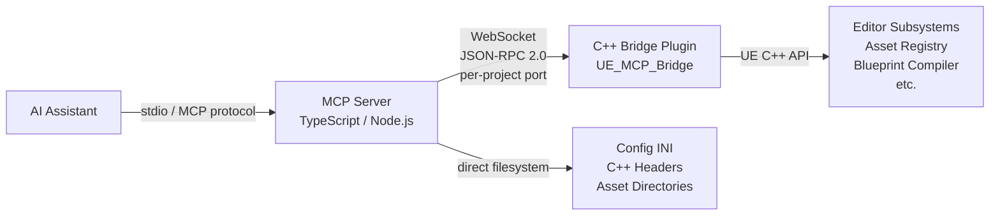
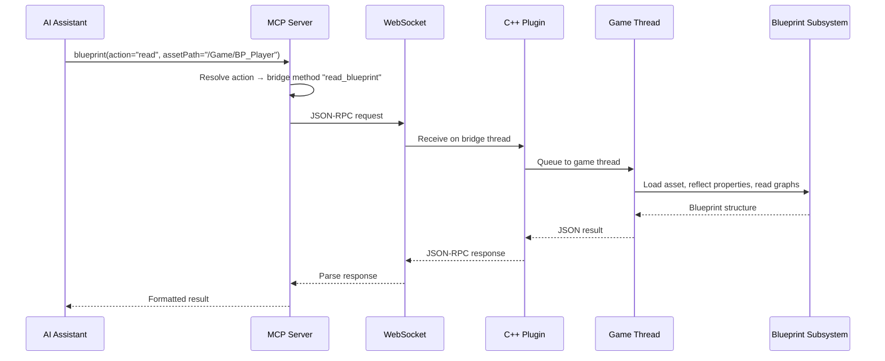

# Architecture

UE-MCP has two main components: a **TypeScript MCP server** that handles the AI protocol, and a **C++ plugin** that runs inside the Unreal Editor and exposes engine APIs over WebSocket.



## MCP Server (TypeScript)

**Entry point:** `src/index.ts`

The server creates an `McpServer` instance (from `@modelcontextprotocol/sdk`), registers <!-- count:tools -->24<!-- /count --> category tools plus a `flow` tool, and communicates with the AI client over stdio.

### Key Modules

| Module | Purpose |
|--------|---------|
| `index.ts` | Tool registration, MCP server lifecycle |
| `tools.ts` | The `ALL_TOOLS` registry consumed by `index.ts` and tests |
| `bridge.ts` | `EditorBridge` (implements `IBridge`) - WebSocket client, JSON-RPC messaging, auto-reconnect |
| `project.ts` | `ProjectContext` - path resolution, INI parsing, C++ header parsing |
| `types.ts` | `ToolDef`, `ActionSpec`, `categoryTool()` factory |
| `schemas.ts` | Shared Zod schemas - `Vec3`, `Rotator`, `Color`, `Quat` |
| `errors.ts` | `McpError` class with `ErrorCode` enum for structured error handling |
| `deployer.ts` | First-run deployment: copy plugin, mutate `.uproject` |
| `editor-control.ts` | Start/stop/restart the Unreal Editor process |
| `instructions.ts` | AI-facing server instructions (embedded documentation) |
| `auth.ts` | GitHub OAuth device flow + `~/.ue-mcp/auth.json` token cache (default authorship path for feedback issues) |
| `github-app.ts` | GitHub App auth used as the bot fallback when OAuth isn't authorized |
| `flow/` | Flow engine (registry, loader, task factory, HTTP server) - see [Flows](flows.md) |
| `init.ts` / `update.ts` / `resolve.ts` / `hook-handler.ts` | CLI subcommands (`npx ue-mcp init`, `update`, `resolve`, `hook`) |

### Tool Registration Pattern

All tools use the `categoryTool()` factory:

```typescript
export const levelTool: ToolDef = categoryTool(
  "level",                              // tool name
  "Actors, selection, components...",    // description
  {
    get_outliner: bp("get_outliner"),           // bridge action
    get_current:  { handler: localHandler },    // local action
  },
  "- get_outliner: List actors...",     // AI-facing docs
);
```

**Two action types:**

- **Bridge actions** (`bp()`) - forwarded to the C++ plugin over WebSocket
- **Local actions** - handled in Node.js (filesystem operations like INI parsing, C++ header reading)

### Bridge Communication

The `EditorBridge` maintains a WebSocket connection to the bridge's per-project port (derived from the project root path, published to `<project>/Saved/UE_MCP_Bridge/port.json`; see [Configuration](configuration.md#bridge-connection)). The legacy fixed `9877` is the fallback when no project root is known.

Editor lifecycle actions (`start_editor`, `stop_editor`, `restart_editor`) do not share that fallback. They act on a process rather than on a connection, so they resolve the target editor from the project's lockfile alone and refuse when it is absent, and they scope every process check to the `.uproject` on the command line. See [Which editor lifecycle actions act on](configuration.md#which-editor-lifecycle-actions-act-on).

**Protocol:** JSON-RPC 2.0

```json
// Request
{
  "jsonrpc": "2.0",
  "id": "req-42",
  "method": "get_outliner",
  "params": { "classFilter": "StaticMeshActor" }
}

// Response
{
  "jsonrpc": "2.0",
  "id": "req-42",
  "result": { "actors": [...] }
}
```

- **Timeout:** 30 seconds per request
- **Reconnect:** Automatic every 15 seconds if disconnected
- **Thread safety:** All responses are correlated by request ID

#### Framing

A TCP read is a byte-stream event, not a message event, so the bridge treats it as one. Both ends accumulate bytes, decode as many whole WebSocket frames as have arrived, and join continuation frames into one message. Several pipelined requests in a single segment all arrive; a payload split across segments is reassembled rather than dropped.

A single message is bounded at 64 MiB, as is the unparsed receive buffer, and so is any single frame's declared length. Exceeding any of them closes the connection with WebSocket status `1009` and a reason naming both the size and the limit, which the client repeats verbatim rather than reporting a generic lost connection. A frame stream that stops parsing (reserved bits set, an unknown opcode, a fragmented control frame, or a client frame sent unmasked, which RFC 6455 forbids) closes with `1002`.

Control frames are answered as the protocol requires: a close frame gets its status code echoed back, a ping gets a pong carrying the same payload. When the editor shuts down with a client attached, the bridge closes with `1001` going away rather than severing the socket.

The upgrade request is read through to its blank line under one deadline and one size bound, and is validated before a `101` is sent: `GET`, HTTP/1.1, `Upgrade: websocket`, `Connection: Upgrade`, `Sec-WebSocket-Version: 13`, and a `Sec-WebSocket-Key` that decodes to 16 bytes. A refusal answers with an HTTP status and a sentence. Anything the client pipelined behind the request is handed straight to the frame reader.

#### Capability handshake

On connect the client asks `get_bridge_capabilities`, which the bridge answers on the socket thread without touching the game thread. The reply reports:

| Field | Meaning |
|-------|---------|
| `protocolVersion` | Wire protocol the plugin speaks (`UEMCP_BRIDGE_PROTOCOL_VERSION`) |
| `handlerApiVersion` | Handler ABI for native plugins (`UEMCP_BRIDGE_API_VERSION`) |
| `builtAt` | Compile timestamp of the loaded binary. The stale-build tell |
| `engineVersion`, `projectName`, `pid`, `port`, `instanceId`, `startedAt` | Which editor answered |
| `features` | Named capabilities, for asking about one thing rather than a version floor |
| `actions`, `actionCount` | The method names the running binary actually registered |

A plugin built before the handshake existed answers `Unknown method`, which the client records as protocol version 1. When the plugin and client versions differ, the client says so once at connect, repeats it on any unknown-method answer (naming both versions and the method), and reports it under `bridgeProtocol` in `project(get_status)`.

`bridgeApiVersion` in `project(get_status)` is read from the header on disk and therefore describes the source; `bridgeProtocol` comes from the running binary. When the two disagree, the deployed plugin has not been rebuilt.

#### Socket and thread ownership

The accept loop creates a client socket and hands it to one connection thread, which owns it from that moment and closes it exactly once. No other code closes a client socket.

Connections are counted by the accept loop before their thread exists and released by the thread on its way out, so shutdown waits for the count to reach zero before the module frees the server object. Connections notice the stop flag at the end of their current one-second select; only if that grace period lapses does shutdown half-close their sockets, and only after a further wait does it give up and log which connections are stuck. The game-thread executor abandons in-flight waits once shutdown begins, since module teardown runs on the game thread and a queued handler will never execute.

## C++ Bridge Plugin

**Location:** `plugin/ue_mcp_bridge/`
**Module type:** Editor-only

The plugin runs a raw WebSocket server on a dedicated thread, dispatches incoming JSON-RPC requests to registered handler functions, and executes them on the game thread.

### Core Classes

| Class | Purpose |
|-------|---------|
| `FMCPBridgeServer` | WebSocket server (raw platform sockets, Windows + Linux/Mac) |
| `FMCPHandlerRegistry` | Maps method names to C++ handler functions |
| `FMCPGameThreadExecutor` | Queues tasks to the game thread (required for UE API access) |
| `HandlerUtils.h` + `HandlerAssetCreate.h` | Shared utilities - `MCPError`/`MCPSuccess`/`MCPResult`, `RequireString`/`OptionalVec3`/`OptionalRotator`/etc., `FindActorByLabel`/`FindActorByLabelOrName`, `MCPCheckAssetExists`/`MCPCheckActorLabelExists`, `LoadAssetByPath<T>`, `LoadBlueprintCDO<T>`, `MCPCreateAssetIdempotent<T>`, `SaveAssetPackage`. |

### Handler Categories

28 C++ handler groups are registered in `BridgeServer.cpp`. Together they expose <!-- count:actions -->783+<!-- /count --> method names (some of which are aliases mapped onto a smaller number of canonical handlers):

| Handler group | Coverage |
|---------|----------|
| EditorHandlers | Console, Python, PIE, viewport, build, logs, perf, screenshots, scalability |
| AssetHandlers | CRUD, import, search, datatables, textures, sockets, FTS search |
| BlueprintHandlers | Read/write, graphs, compilation, node types, T3D import/export, reparent, validate |
| LevelHandlers | Actors, components, volumes, lights, world settings, splines |
| ReflectionHandlers | Class/struct/enum reflection, gameplay tags |
| MaterialHandlers | Materials, instances, expression graph authoring, declarative builder, render preview |
| AnimationHandlers | Anim BPs, montages, blendspaces, skeletons, IK Rig, ControlRig, virtual bones, live-actor bone reads + leader-pose rebind + preview-animation toggle |
| AudioHandlers | Playback, ambient sounds, SoundCues, MetaSounds |
| WidgetHandlers | UMG widget trees, editor utility widgets and blueprints |
| FoliageHandlers | Foliage types, instance queries |
| LandscapeHandlers | Landscape proxies, layer-info assets, materials |
| NetworkingHandlers | Replication, dormancy, relevancy, net priority |
| NiagaraHandlers | VFX systems, emitters, renderers, data interfaces, GPU HLSL inspection |
| PCGHandlers | Procedural generation graphs, mesh spawner authoring |
| GasHandlers | Gameplay Ability System (attributes, abilities, effects, cues) |
| GameplayHandlers | Physics, collision, navigation, AI (BTs, EQS, perception), input, game framework |
| PhysicsHandlers | Collision profiles, simulation toggles, body properties |
| SequencerHandlers | Level sequences and tracks |
| SplineHandlers | Spline actor authoring |
| DialogHandlers | Modal dialog auto-response policies |
| StateTreeHandlers | StateTree asset authoring (states, transitions, tasks, root parameters) |
| ChooserHandlers | Chooser table authoring |
| EpicHandlers | Epic 5.8 native toolset surfacing |
| FabHandlers | Fab owned-library import |
| LockHandlers | Per-asset exclusive locks for concurrent agents (acquire/release/list, TTL-leased) |
| DiffHandlers | Semantic Blueprint and asset diffing |
| ProjectHandlers | Project info, world subsystem queries |
| DemoHandlers | Neon Shrine demo builder |

### Plugin Modules

The plugin ships two modules, loading at different phases:

| Module | Loading phase | Role |
|--------|---------------|------|
| `UE_MCP_BridgeStatus` | `PostConfigInit` | Publishes what the engine is doing (phase, slow-task name and percent, modal dialog, compile counts, game-thread stall) to `Saved/UE_MCP_Bridge/status.json` from a writer thread. Core-only dependencies, so it can load this early. |
| `UE_MCP_Bridge` | `PostEngineInit` | The WebSocket server, the handler registry, and the Slate/Engine-backed sensors it injects into the status snapshot. |

The split exists because the interesting failures happen before `PostEngineInit`: RHI init, plugin module loading, map load and Python startup all run while a single-module plugin would not yet exist. The status module covers that window; the bridge module upgrades the same snapshot once Slate, the shader compiler and the asset compiler are available.

### Plugin Dependencies

The C++ plugin links against a wide range of UE modules:

- **Core:** Core, CoreUObject, Engine, Json, JsonUtilities, GameplayTags
- **Editor:** UnrealEd, AssetRegistry, BlueprintGraph, Kismet, KismetCompiler, PropertyEditor
- **Systems:** Landscape, Niagara, PCG, Sequencer, UMG, GameplayAbilities, NavigationSystem, AIModule
- **Tools:** LiveCoding (Windows only), MaterialEditor, EditorScriptingUtilities, DataValidation

## Hybrid Architecture

A key design principle: **read operations work without the editor**.

| Operation Type | Requires Editor? | How |
|----------------|-------------------|-----|
| INI config parsing | No | Direct filesystem |
| C++ header reflection | No | Regex-based parsing |
| Asset directory listing | No | Filesystem scan |
| Blueprint reading | Yes | C++ bridge |
| Actor placement | Yes | C++ bridge |
| Material authoring | Yes | C++ bridge |
| PIE control | Yes | C++ bridge |
| Build pipeline | Yes | C++ bridge |

This means the AI can explore project structure, read configs, and understand C++ code even when the editor isn't running.

## Path Resolution

The `ProjectContext` handles path formats:

| Input | Resolved To |
|-------|-------------|
| `/Game/MyAsset` | `<ProjectDir>/Content/MyAsset` |
| `/MyPlugin/Assets/Foo` | `<ProjectDir>/Plugins/MyPlugin/Content/Assets/Foo` |
| Absolute path | Used as-is |
| Relative path | Relative to project root |

## Data Flow Example

Here's what happens when the AI calls `blueprint(action="read", assetPath="/Game/BP_Player")`:


