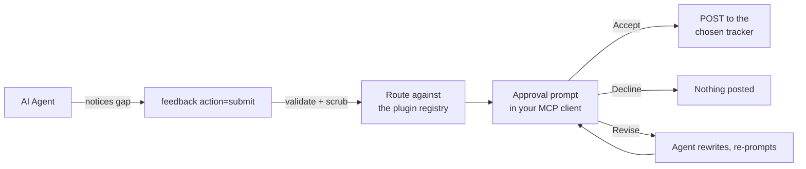

# Feedback

`feedback(submit)` files a GitHub issue describing a tool gap, so maintainers can close it with a native handler. It picks the tracker that owns the surface being reported - ue-mcp core, or the plugin that provides it - by consulting the [plugin registry](https://plugins.ue-mcp.com). The flow is gated on explicit user approval (no agent-mediated consent), and the body is server-side scrubbed for credentials and personal/project identifiers before anything leaves your machine.

## How it works



1. Agent calls `feedback(action="submit")` with `title` and `summary` (plus optional `pythonWorkaround` / `idealTool`).
2. Server validates the submission (rejects placeholder titles, meta-apology phrases, too-short summaries, etc.).
3. Server works out which tracker owns the surface ([jump to section](#routing-to-the-right-tracker)).
4. Server assembles the body, applies a credential scrub pass and a privacy redaction pass ([jump to section](#what-gets-scrubbed)).
5. Server requests an **MCP elicitation** - your client surfaces an approval prompt with the full body, the destination tracker, an optional revisions text field, and an Accept / Decline action.
6. Based on your choice the server submits the POST, returns a revision directive to the agent, or discards.

## Routing to the right tracker

ue-mcp is a core server plus a set of npm-distributed plugins, each with its own repo and its own issue tracker. An agent that hits a wall in a plugin-provided surface has no way to know the surface is not core, so without routing every report lands on the core tracker and has to be re-filed by hand.

Before assembling the body, the server reads the published catalog from `https://plugins.ue-mcp.com/api/plugins` (cached for 15 minutes in-process and on disk at `~/.ue-mcp/registry-catalog.json`) and combines it with the plugins actually loaded in your project. Precedence, strongest first:

| Signal | Example | Result |
|---|---|---|
| `repo` parameter | `repo="db-lyon/pie-studio"` | Honored, but **only** for ue-mcp core or a repo a registered plugin owns. Anything else is ignored and the report files against core. |
| Ownership | `idealTool="pie(action=replay)"` and a loaded plugin provides the `pie` category | That plugin's repo, confidence `certain`. |
| Core anchor | The text names a built-in action such as `editor(play_in_editor)` | Core keeps it, even when a plugin also matched. The match is still shown at the prompt. |
| Identity terms | The title names the plugin's slug, name, or a category it provides | That plugin's repo, confidence `likely`. |
| Tag terms only | A listing's descriptive tag (`import`, `replay`) appears in the text | Core keeps it. The match is offered at the prompt as a one-click override. |

A plugin whose registry row has no public repo (or a private one) never becomes the destination; the report goes to core with a note naming the real owner.

Preview the decision without posting anything:

```text
feedback(action="route",
  title="pie(replay) diverges from the recorded run after 200 frames",
  summary="Replaying a recorded PIE session drifts from the capture...")
```

It returns the target repo, the matched plugin and why, any runner-up suggestions, the core anchor it found, and whether the registry was reachable.

Every posted issue carries a `## Routing` section stating what was matched and on what evidence. It describes the analysis, not the destination, so it reads the same whether you accept the suggested tracker or override it - which is also why flipping the tracker at the prompt cannot change the bytes you just read.

Registry lookups never block a submission: an unreachable registry with no cached copy resolves to core, the behaviour that existed before routing did. To pin every report to core and skip the lookup entirely:

```bash
UE_MCP_FEEDBACK_ROUTING=off npx ue-mcp ./MyGame.uproject
```

!!! note "Labels off-core"
    Core category labels (`blueprint`, `niagara`, ...) describe the ue-mcp core surface. A report filed on a plugin repo carries `agent-feedback` plus any type label (`bug`, `enhancement`) and nothing else.

If the chosen tracker refuses the issue (issues disabled, or your account cannot open one there), nothing is posted anywhere. The tool returns a prefilled `https://github.com/<owner>/<repo>/issues/new?...` URL and the option to re-run against core. In `auto-approve` mode - where nobody is at the keyboard to read that - the report falls back to the core tracker and says so in the result.

## Feedback modes

The default is **interactive** - every `feedback(submit)` blocks on the MCP elicitation approval prompt. Two other modes exist for autonomous / long-running agent sessions where waiting for human input on every submission isn't acceptable.

The mode is a **per-user, per-device** preference, not a project policy - it's stored in `~/.ue-mcp/state.json`, not in the tracked `ue-mcp.yml`. The agent has no surface to change it.

| Mode | What happens on `feedback(submit)` | When to use it |
|---|---|---|
| `interactive` (default) | Server scrubs + opens the elicitation prompt; you Accept / Decline / request revisions. Nothing posts without explicit human approval. | Default. Use whenever a human is at the keyboard. |
| `auto-approve` | Server scrubs + posts directly to GitHub. No prompt. | Long-running unattended agent sessions where you trust the agent's title/summary judgment. **Still applies the credential and privacy scrubs.** |
| `defer` | Server scrubs + writes the payload to `~/.ue-mcp/pending-feedback/<id>.json` instead of posting. No prompt, no network call. | Long-running unattended agent sessions where you want to review what would have been filed before any of it leaves the machine. Use `npx ue-mcp feedback list/show/approve/discard` to act on the queue afterward. |

Set or inspect the mode with:

```bash
npx ue-mcp feedback mode                 # show the effective mode and where it came from
npx ue-mcp feedback mode defer           # persist the mode in ~/.ue-mcp/state.json
npx ue-mcp feedback mode auto-approve
npx ue-mcp feedback mode interactive
npx ue-mcp feedback mode default         # clear the preference (back to "interactive")
```

For a one-off agent run, set the env var instead - it overrides the persisted preference and is not written to disk:

```bash
UE_MCP_FEEDBACK_MODE=defer npx ue-mcp ./MyGame.uproject
```

Precedence: `UE_MCP_FEEDBACK_MODE` env > `~/.ue-mcp/state.json` preference > default `interactive`.

### Reviewing deferred submissions

```bash
npx ue-mcp feedback review           # walk every pending entry, one at a time
npx ue-mcp feedback list             # show pending entries
npx ue-mcp feedback show <id>        # full title + body + labels
npx ue-mcp feedback approve <id>     # POST to GitHub, then remove
npx ue-mcp feedback discard <id>     # delete without posting
```

`review` is **experimental** in this release. It is the path of least friction once you have more than one entry queued: it prints each item in turn and asks `[a]pprove  [d]iscard  [s]kip  [q]uit`. Approved items POST to GitHub and are removed from disk; discarded items are deleted without posting; skipped items stay on disk for the next pass; quit stops the loop and leaves the rest untouched. If a POST hits an auth prompt or a network failure, the loop stops with the entry left on disk so you can resume after fixing the cause. The per-id `approve`/`discard` commands are still there for scripting and one-offs.

Deferred entries are stored at `~/.ue-mcp/pending-feedback/<id>.json` (override with `UE_MCP_PENDING_DIR`). The recorded `author` choice from the original `feedback(submit)` is honored on approve, as is the tracker it was routed to - `list` and `show` print it, so you can see where each pending entry is headed before approving it. Entries written before routing existed carry no tracker and approve against core.

### Threat-model note

Both `auto-approve` and `defer` bypass the elicitation consent gate. The scrubs (credential + privacy) still run server-side regardless of mode - auto-approve doesn't downgrade the redaction story, it just removes the human-in-the-loop confirmation that the scrub caught everything you care about. Use defer instead if you want unattended operation **with** human review before anything ships.

## The approval prompt

The prompt the elicitation request opens has:

- The exact body that would post to GitHub (already redacted)
- The destination tracker, and a `ROUTING` block explaining why when a plugin matched
- A line declaring who the issue will author as (`@your-github-user` or `ue-mcp-feedback bot`)
- A `Submit with revisions (optional)` text field
- A `Tracker` field, when there is a second tracker worth offering
- Your MCP client's built-in **Accept** / **Decline** action buttons

Outcomes:

| Click | Revisions field | Result |
|---|---|---|
| Accept | empty | The body is POSTed to the tracker named in the `Tracker` field |
| Accept | filled in | Server returns your notes to the agent; the agent rewrites and triggers a fresh approval prompt for the revised body. Nothing posts until you re-approve. |
| Decline | (any) | Discarded. The agent receives a declined directive and stops. |

The `Tracker` field only ever offers the two repos named on the prompt (the routed one and its alternative). A value that was not offered is ignored and the default stands.

The agent has no way to bypass this prompt or forge a response - the consent signal comes from your client's UI, not from a tool result.

!!! info "Requires elicitation support"
    `feedback(submit)` requires the connected MCP client to advertise the `elicitation` capability. Claude Code 2.1.76+ supports it. If your client does not, the call returns a `feedback.blocked` directive with `code: "elicitation_unsupported"` instead of posting.

## Authorship

The `author` parameter is an enum with two values:

- `author: "user"` (default) - issue is authored by your real GitHub account via a cached OAuth token
- `author: "bot"` - issue is authored anonymously by the `ue-mcp-feedback[bot]`

If `author="user"` and no OAuth token is cached, the call returns an `auth_required` directive. Run `npx ue-mcp auth` to authorize, or call with `author="bot"` to post anonymously.

Anonymous reports are signed by a hosted service rather than by this package, so nothing in the install carries a GitHub credential. The report is POSTed to `https://feedback.ue-mcp.com`, and the contract that endpoint implements is: hold the App key server-side, check the destination against ue-mcp core and the trackers of published plugins, rate-limit per caller, then open the issue as `ue-mcp-feedback[bot]`.

Two environment variables redirect it, and a fallback covers the rest:

| Variable | Effect |
| --- | --- |
| `UE_MCP_FEEDBACK` | Origin of the signing service. Default `https://feedback.ue-mcp.com`, posted to at the root. |
| `UE_MCP_FEEDBACK_ENDPOINT` | The full URL, when the path differs too. Exact: no other origin is tried. |
| `UE_MCP_REGISTRY` | Set on its own, that origin's `/api/feedback` is tried first, since a self-hosted deployment is what its operator meant. |

Without either feedback variable the client tries `https://feedback.ue-mcp.com` and then `https://plugins.ue-mcp.com/api/feedback`, which is where the service used to live. The second is only reached when the first does not answer at all (DNS, TLS, timeout, or a gateway page instead of the endpoint). An answer of any kind, including "not configured" or "rate limited", is taken as final, so a report is never filed twice.

If that service is unreachable or turned off, nothing is lost: the call returns the approved body as a prefilled "new issue" URL you can open in one click, and `author="user"` keeps working independently.

**Status:** the endpoint is live but has no signing key installed yet, so it answers `signing_not_configured` and `author="bot"` takes the prefilled-URL path on every call today. See [#461](https://github.com/db-lyon/ue-mcp/issues/461) for the design and the reason the key left the package first. `author="user"`, the default, posts directly and is unaffected.

### Authorizing as your GitHub user

```bash
npx ue-mcp auth
```

Runs the GitHub device flow: prompts you to open a URL, enter a code, and authorize the `ue-mcp-feedback` GitHub App. On success the token is cached at `~/.ue-mcp/auth.json` (mode 600) and every subsequent `feedback(submit)` defaults to authoring as your user.

This same step is offered inside `npx ue-mcp init` when you opt into the feedback prompt hook. Run `auth` standalone if you skipped that and want to authorize later.

## What gets scrubbed

Two passes run server-side on the assembled title and body, before either reaches the approval prompt or the GitHub POST. The agent cannot bypass them or see the pre-scrubbed bytes.

### Credential scrub

Common credential shapes are replaced with `[REDACTED]`:

- GitHub PATs and App tokens (`ghp_`, `gho_`, `ghu_`, `ghs_`, `ghr_`, `github_pat_…`)
- AWS access key IDs (`AKIA…`, `ASIA…`)
- Slack tokens (`xoxb-`, `xoxp-`, etc.)
- Stripe live/test secret keys (`sk_live_`, `sk_test_`)
- Anthropic API keys (`sk-ant-…`)
- OpenAI keys (`sk-…`)
- JSON Web Tokens (`eyJ…eyJ…`)
- PEM blocks (`-----BEGIN … PRIVATE KEY-----`)
- Env-style assignments where the key name names a secret (`PASSWORD=`, `TOKEN=`, `API_KEY=`, etc.)

Novel shapes can pass through. Read the body on the approval prompt before clicking Accept.

### Privacy scrub

Personal and project identifiers are replaced with stable placeholders:

| What | Replacement |
|---|---|
| Absolute project root path | `REDACTED_PROJECT_ROOT` |
| OS home directory path | `REDACTED_HOME` |
| Project name (whole word, case-insensitive) | `REDACTED_PROJECT` |
| OS username (whole word, case-insensitive) | `REDACTED_USER` |

Path matching covers both slash and backslash separator conventions so the same path is caught whether it came from `execute_python` output, a JSON config, or a console trace. Word-boundary matching avoids substring false positives (`Davidson` keeps the `d`, `Valedictory` keeps the `V`).

Class, component, and actor names are **not** redacted automatically - the agent often needs to reference them to describe the gap. Use the **Submit with revisions** field on the approval prompt to request additional case-by-case redactions; the agent will rewrite and bring you a fresh prompt.

## Submit parameters

| Parameter | Required | Description |
|---|---|---|
| `title` | Yes | Short title describing the tool gap. At least 10 characters, no placeholder phrases. |
| `summary` | Yes | What was attempted and why the native tool fell short. At least 40 characters. |
| `pythonWorkaround` | No | The `execute_python` code used as a workaround. Enrichment, not a prerequisite - a crash or a missing action is a valid report with nothing to work around. |
| `idealTool` | No | What tool/action should handle this natively (e.g. `blueprint(action='set_variable_default')`). Also the strongest routing signal: it names the category that failed. |
| `author` | No | `"user"` (default) or `"bot"`. See [Authorship](#authorship). |
| `repo` | No | `owner/name` tracker override. Leave it off - routing picks the repo. See [Routing](#routing-to-the-right-tracker). |

`feedback(action="route")` takes `title`, `summary`, `idealTool`, and `repo`, and posts nothing.

## Example

```text
feedback(action="submit",
  title="Cannot set default values for Blueprint variables",
  summary="Tried to set a default value on a Blueprint variable. add_variable creates the variable but there's no action to set its default. Had to use execute_python to access the variable's DefaultValue property directly.",
  pythonWorkaround="import unreal; bp = unreal.load_asset('/Game/BP_Player'); ...",
  idealTool="blueprint(action='set_variable_default', assetPath, name, defaultValue)"
)
```

The agent makes the call; you see the approval prompt; you click Accept (with or without revisions) or Decline.

## Claude Code prompt hook

`npx ue-mcp init` offers (opt-in, default off) to install a Claude Code PostToolUse hook that fires after every `execute_python` call. The hook injects a system message asking the agent to surface the workaround to you and offer `feedback(submit)`. Without the hook, the agent will only file feedback if you ask for it directly.

The hook lives in `<project>/.claude/settings.json`. Its path is also recorded in `~/.ue-mcp/state.json` under this project's entry so re-running init can find and remove it cleanly. (User-machine state lives outside the project tree because the paths are absolute and machine-specific.) Remove all installed hooks manually with:

```bash
npx ue-mcp uninstall-hooks
```

The hook handler self-gates: if `feedback` is in `ue-mcp.yml`'s `ue-mcp.disable[]`, or no `ue-mcp.yml` is reachable from the cwd, the hook silently no-ops even if the matcher is still in `settings.json`.

## Security model

- **The agent is the adversary for the consent step.** The MCP elicitation prompt is rendered by your client, and the response comes back to the server over the protocol - the agent has no IPC to forge an approval.
- **The redaction passes are non-bypassable.** They run before the body reaches the elicitation prompt or `submitFeedback`, and the agent never sees the pre-scrubbed bytes.
- **Routing cannot aim a report at an arbitrary repo.** The `repo` parameter is accepted only for ue-mcp core or a repo a registered plugin owns, and the `Tracker` field on the approval prompt only accepts the two values it offered. There is no path from "an agent wrote a string" to "an issue on any GitHub project".
- **The package ships no credentials.** `author="user"` posts with a token you authorized yourself through GitHub's device flow, stored under `~/.ue-mcp/`. `author="bot"` posts through a hosted signing service (`POST https://feedback.ue-mcp.com`) whose contract is to hold the `ue-mcp-feedback` App key server-side, apply per-caller rate limits, re-run the redaction pass, and only open issues on ue-mcp core or the tracker of a published plugin. Until a signing key is installed on that deployment the anonymous path hands back a prefilled issue URL instead of posting. Either way there is no key inside the package to extract.
- **Disable the category if you don't want it available.** Add `"feedback"` to `ue-mcp.yml`'s `ue-mcp.disable[]` and the tool is not registered with the MCP server. The category checkbox lives in the **Agent behavior** section of `npx ue-mcp init` (default unchecked on fresh installs).

## For maintainers

Submitted issues carry the `agent-feedback` label and include:

- **Summary** - what the user was trying to do (post-scrub)
- **Ideal Tool/Action** - suggested native tool signature, if supplied
- **Python Workaround Used** - the workaround code (post-scrub), if supplied
- **Session Workaround Log** - every `execute_python` call recorded during the session (post-scrub)
- **Routing** - the plugin the classifier matched and the evidence, when one matched. On a core issue it is the hint that the report may belong to a plugin; on a plugin issue it is why it arrived there.

These form a prioritized backlog of tool gaps to close.

## Resolving feedback issues

```bash
npx ue-mcp resolve <issue-number>
```

Fetches the issue, creates a branch, launches Claude Code to implement the fix, and opens a PR. See [Getting Started](getting-started.md#resolving-issues) for details.
