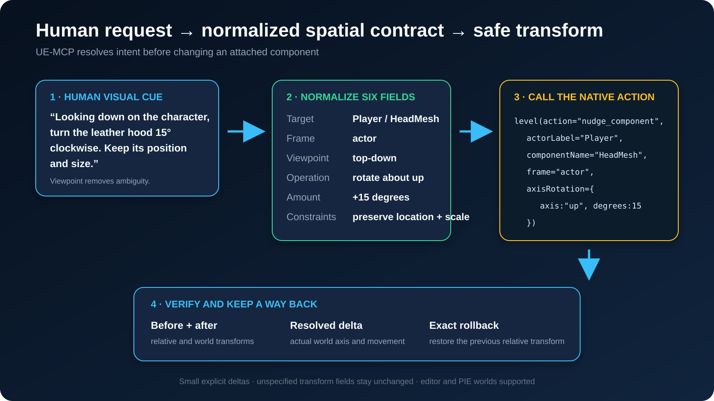
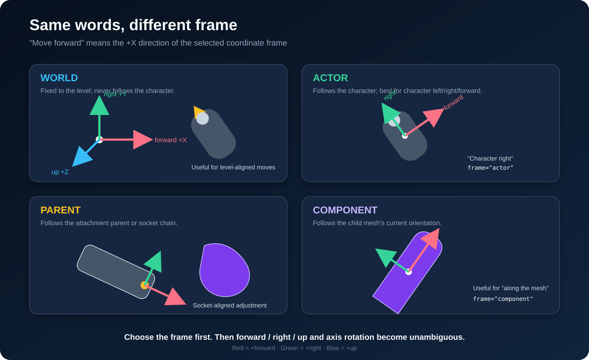
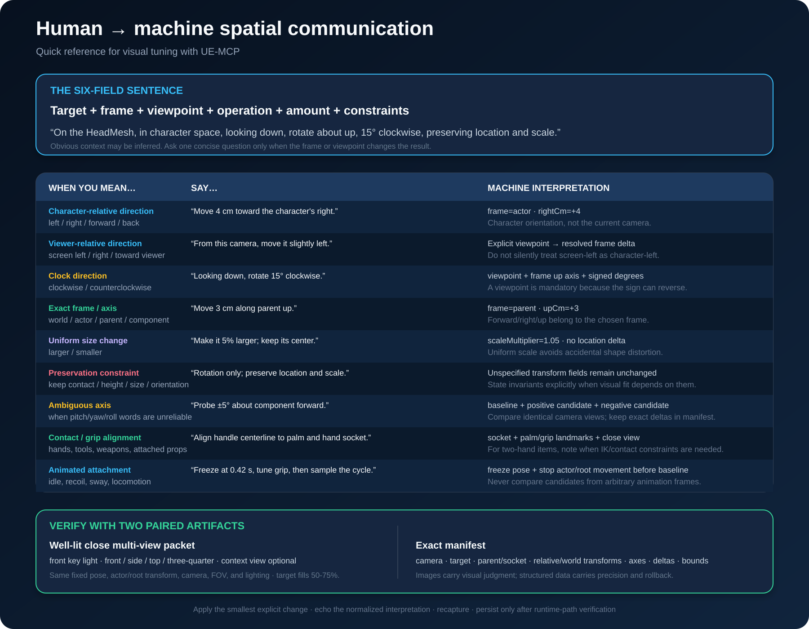

# Spatial instructions

A human says "turn the hood a bit clockwise". An editor needs an axis, an angle,
a coordinate frame, and a promise about what must not move. This page is how one
becomes the other.

It exists because the failure it prevents is silent. A raw relative-Euler edit on
an attached or socketed component changes axes nobody asked about, reports
success, and looks fine in the response. The mistake only surfaces in a
screenshot, usually later, usually to a person.

## The six-field sentence

Every spatial request normalizes to six fields. If all six are known, the
transform is unambiguous.



| Field | Answers | Example |
|---|---|---|
| Target | Which actor, and which component on it | `Player` / `HeadMesh` |
| Frame | Whose axes | `actor` |
| Viewpoint | Looking from where | looking down |
| Operation | Translate, rotate, or scale | rotate about up |
| Amount | How much, in real units | 15 degrees clockwise |
| Constraints | What must not change | preserve location and scale |

Most requests supply three or four of these and imply the rest. Infer what is
obvious. Ask exactly one question when the missing field would change the
result, which in practice means frame or viewpoint.

## Frame: whose axes are these?

"Move forward" means the +X direction **of the selected frame**. The same words
produce four different moves.



- **world** is fixed to the level and never follows the character. Use it for
  level-aligned moves: "line it up with the wall".
- **actor** follows the character. This is what a person means by left, right,
  forward and back when they are talking about a character.
- **parent** is the attachment parent's frame. Use it when the component should
  move consistently with whatever it hangs off.
- **component** is the component's own current orientation. Use it for "push it
  further along the way it is already pointing".

When a person says "the character's right", they mean `frame="actor"`. They do
not mean the camera, even though the camera is what they are looking at.

## Viewpoint: clockwise is incomplete without it

Clockwise is not a property of a rotation. It is a property of a rotation
**plus** the side you are viewing it from. The same rotation is clockwise and
counterclockwise depending on where you stand.


So "rotate it clockwise" is not yet an instruction. "Looking down on the
character, rotate it 15 degrees clockwise" is: it names the axis (actor up) and
the sign together.

If a request says clockwise without a viewpoint, that is the one question worth
asking.

## Phrase book



## Doing it

`level(nudge_component)` takes the normalized fields directly. It composes
quaternion deltas rather than writing Euler angles, which is what keeps an
attached or socketed component from drifting on axes that were never mentioned.

```text
level(action="nudge_component",
      actorLabel="Player",
      componentName="HeadMesh",
      frame="actor",
      viewRotation={ viewFrom: "above", direction: "clockwise", degrees: 15 },
      dryRun=true,
      world="editor")
```

This previews the requested inputs without moving anything. It returns the exact
component path, attachment/socket, absolute transform flags, current bounds,
relative/world transforms with quaternions, and the selected frame's world axes.
`operationApplied=false` means inspection or preview, never a completed edit.
Omit the deltas to use `dryRun=true` as a spatial inspection call.

`viewFrom` names the observer's side **in the selected frame**, looking toward
the target. It does not read or guess the player/editor camera:

| View from | Observer side | Rotation axis | Clockwise signed degrees |
|---|---|---|---|
| front | +X | forward | positive |
| back | -X | forward | negative |
| right | +Y | right | positive |
| left | -Y | right | negative |
| above | +Z | up | positive |
| below | -Z | up | negative |

Counterclockwise reverses the sign. The native tests project all twelve cases
into camera right/up axes. Under Unreal's quaternion convention a positive
angle about `up` carries +X toward +Y, which a viewer above reads as clockwise,
so clockwise from above is `axisRotation={axis:"up",degrees:15}`. Reach for
`viewRotation` and let the engine pick the sign.

`viewRotation` and signed `axisRotation` are mutually exclusive. Magnitudes in
`viewRotation` must be finite and greater than zero. `frame=parent` uses the
parent component's orientation; the attachment socket is reported separately.

Echo the resolved target, frame, viewpoint and amount in ordinary language.
If these agree with the user's request, make the same call with `dryRun=false`.
No additional confirmation is required for an already authorized edit. The
preview reports **requested setter inputs**, not a guaranteed final transform:
socket attachment, absolute flags, scale, physics and construction can affect
the result. Read the applied call's `after` transform and rollback data.

Translation is in centimetres along the frame's forward, right and up. Scale is a
uniform multiplier. Rotation is an axis and an angle, never three Euler numbers.

## Verifying

Keep `capture_scene_png`'s `captureMetadata` beside each image. It contains the
actual camera location/rotation/basis, FOV, image dimensions, world/PIE identity,
world time, texture-loading setting and resolved focus actor/bounds. These are
measurements of this capture, not a claim that its lighting or pose was suitable.
`get_viewport_state`, `set_viewport_exposure` and `hit_test_viewport_pixel` refer
to the editor viewport, not this separate SceneCapture2D. Do not use the live
viewport's pixel hit test to locate a point in a headless capture.

A spatial change is only done when someone can see that it is done. Read the
returned transform, and for anything a human will look at, capture an image.

Frame the capture so the contact region fills roughly half to three quarters of
the shot, and take it from more than one angle: front, side, top, three-quarter.
A single wide shot or a dark shot proves nothing, and accepting one is how a
wrong result gets reported as a right one.

When the target is attached to a character, stop the actor and freeze the parent
skeletal pose before the baseline capture, and hold both across every subsequent
probe. Otherwise the pose moves between captures and the comparison measures the
animation rather than the edit.

## When to ask

Ask when the answer changes the transform:

- clockwise or counterclockwise with no viewpoint named
- left or right when it is genuinely unclear whether the character or the camera
  is the reference
- a component that is attached, where the frame decides whether the parent
  carries the change

Do not ask when context settles it. "Move the character's arm forward 5 cm" has
a target, a frame, an operation and an amount, and the missing viewpoint does not
affect a translation.
